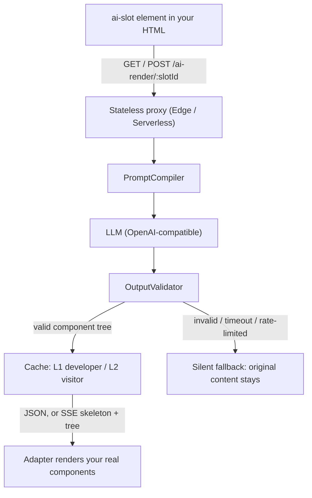

<div align="center">

# ai-slot-component

**Add AI-generated content to any existing web page — with a guaranteed fallback.**

English | [简体中文](./README.zh-CN.md)

[](https://nodejs.org)
[](https://pnpm.io)
[](./packages/runtime)
[](./packages/adapter-react)
[](./packages/adapter-vue)
[](https://www.npmjs.com/package/@ai-slot/runtime)

</div>

Your page today:

```html
<section class="hero">
  <h1>Our product</h1>
  <p>A normal product intro.</p>
</section>
```

With ai-slot — the same markup, wrapped, nothing rewritten:

```html
<ai-slot name="hero" src="/ai-render/hero" editable stream live>
  <section class="hero">
    <h1>Our product</h1>
    <p>A normal product intro.</p>
  </section>
</ai-slot>
```

Behind that element, a stateless server proxy asks an LLM to fill or rewrite the region and returns a **validated component tree** — never HTML — which is rendered as *your* real components. If the model times out, invents a component name, or violates a prop schema, the original markup above silently stays. Your SEO, accessibility and uptime never depend on the model.

## Quick Start

Prerequisites: Node ≥ 18, [pnpm](https://pnpm.io) (`corepack enable`). No API key needed — the demo ships with a deterministic mock LLM.

```bash
git clone https://github.com/iannil/ai-slot-component
cd ai-slot-component
pnpm install && pnpm build
node examples/plain-html/server.mjs
# → open http://localhost:4173
```

The demo page covers the whole feature set: an `editable` + `stream` + `live` hero slot, a `broken` slot that shows the silent fallback, and `POST /admin/publish` to simulate a data-source change.

To use a real model instead of the mock:

```bash
OPENAI_API_KEY=sk-... node examples/plain-html/server.mjs
# optional: AI_BASE_URL (any OpenAI-compatible endpoint)
# optional: AI_MODEL_DEVELOPER (default gpt-4o) / AI_MODEL_USER (default gpt-4o-mini)
```

Got it running? A ⭐ helps others find the project.

<p align="center">
  
</p>
<p align="center">
  
  
</p>

## Why it is safe

- **The model never writes markup.** It returns component-tree JSON whose component names must exist in the registry you declared, validated against prop schemas, slot rules, depth and node-count limits before anything renders. Prompt injection has no path to your DOM.
- **Your page never breaks.** Any failure — network, timeout, rate limit, invalid output — falls back silently to the content inside `<ai-slot>`. No blank screen, no error shown to visitors.
- **Secrets stay on the server.** LLM keys live only in the proxy. Visitor prompts are sanitized, length-capped and injected as bounded context, with token budgets, an 8s timeout, per-minute rate limiting and usage logs.
- **The original content is always in the page.** `<ai-slot>` is progressive enhancement: crawlers and no-JS visitors see your real content.

## Protocol-neutral by design

ai-slot separates three layers:

1. **Slot protocol** — the wire format between the AI endpoint and the page. Native JSON today; [A2UI](https://github.com/a2ui-project/a2ui) (Google's open protocol for agent-driven UI) works too via [`@ai-slot/a2ui`](./packages/a2ui).
2. **Delivery runtime** — `<ai-slot>`, client-side re-validation, and the guaranteed fallback.
3. **Lifecycle infrastructure** — two-tier caching, build-time pregeneration, invalidation push, rate limiting.

Any A2UI-compliant agent endpoint can feed an existing page:

```ts
import { defineRegistry } from "@ai-slot/registry";
import { createDomRenderer } from "@ai-slot/adapter-dom";
import { configureAiSlot, registerRenderer, registerWireFormat } from "@ai-slot/runtime";
import { a2uiWireFormat, basicCatalogComponentDefs, basicCatalogDomDefs } from "@ai-slot/a2ui";

const registry = defineRegistry({
  components: { ...basicCatalogComponentDefs /* , your brand components */ },
});
registerWireFormat("a2ui", a2uiWireFormat);
registerRenderer("dom", createDomRenderer(basicCatalogDomDefs));
configureAiSlot({ registry, onFailure: (f) => console.debug(f) });
```

| | A2UI / AG-UI | ai-slot |
|---|---|---|
| Layer | Wire format for agent ↔ in-app UI (Google / CopilotKit) | Delivery layer for public web content slots — speaks A2UI via `@ai-slot/a2ui` |
| Existing pages | Legacy content isolated in sandboxed iframes | Wraps existing HTML in place, zero rewrite |
| SEO & crawlers | Client-rendered; crawlers see nothing (including Googlebot) | Original content always in the HTML — visible to crawlers and AI search |
| Lifecycle | No server-side component (no cache, prewarm or invalidation) | Two-tier TTL, build-time prewarm, invalidation push, rate limiting |

## Features

- **Drop-in for the site you already have** — wrap existing markup in `<ai-slot>`; plain HTML, React and Vue all work, no rewrite required.
- **Visitors edit with one line** — the `editable` attribute turns any slot into a prompt box scoped to that slot only.
- **Skeleton-first streaming** — `stream` fetches over SSE: a skeleton frame renders immediately, the final tree replaces it.
- **Content updates without a redeploy** — `live` subscribes to invalidation pushes; a data-source change re-renders the slot on every open tab.
- **Pregenerate at build time** — `prewarm.mjs` bakes developer prompts into `ai-cache.json`, so production serves AI content with zero runtime LLM calls.
- **Runs offline out of the box** — deterministic mock LLM by default; unit tests replay fixtures and never hit a real API.
- **Two prompt tiers, two model tiers** — developer prompts are pregenerated and long-cached; visitor prompts are real-time, short-TTL and rate-limited.

## Usage

> All packages are on npm as `@ai-slot/*`: client — `npm install @ai-slot/runtime @ai-slot/adapter-dom` (+ `@ai-slot/a2ui` for A2UI endpoints); server — `npm install @ai-slot/proxy @ai-slot/registry`. To hack on the monorepo instead, clone and `pnpm install && pnpm build`.

**1. Declare what the AI may build with** (shared by proxy, runtime and build tooling):

```ts
import { defineRegistry } from "@ai-slot/registry";

export const registry = defineRegistry({
  components: {
    "hero-banner": {
      description: "Page hero section",
      props: {
        title: { type: "string", maxLength: 60 },
        subtitle: { type: "string", maxLength: 120 },
      },
      required: ["title"],
    },
  },
});
```

**2. Wire the proxy** — a Web-standard `(Request) => Promise<Response>`, deployable to Node, Edge or any serverless runtime:

```ts
import { createAiRenderHandler, createOpenAIClient } from "@ai-slot/proxy";
import { registry } from "./registry.js";

export const handler = createAiRenderHandler({
  registry,
  llm: createOpenAIClient({ apiKey: process.env.OPENAI_API_KEY! }), // baseUrl: any OpenAI-compatible endpoint
  resolveSlot: (slotId) => slots[slotId] ?? null,
});
// Exposes GET/POST /ai-render/:slotId — GET for CI pregeneration, POST for visitor prompts.
```

**3. Render it** — pick your stack:

```html
<!-- Plain HTML -->
<script type="module">
  import { configureAiSlot, registerRenderer } from "@ai-slot/runtime";
  import { createDomRenderer } from "@ai-slot/adapter-dom";
  import { registry } from "./registry.js";
  import { domComponents } from "./components.js";

  registerRenderer("dom", createDomRenderer(domComponents));
  configureAiSlot({ registry });
</script>
```

```tsx
// React ≥ 18 — any failure keeps `fallback`, same semantics as the Web Component
<AiSlot src="/ai-render/hero" components={{ "hero-banner": HeroBanner }} fallback={<HeroStatic />} editable />
```

```vue
<!-- Vue ≥ 3.4 — fallback is the default slot -->
<AiSlot src="/ai-render/hero" :components="vueComponents">
  <HeroStatic />
</AiSlot>
```

### `<ai-slot>` attributes

| Attribute | Effect |
|---|---|
| `src` | Proxy endpoint for this slot (`/ai-render/:slotId`) |
| `name` | Slot id sent to the proxy |
| `renderer` | Registered renderer to use (default `dom`) |
| `editable` | Adds a one-line prompt box that re-renders this slot |
| `stream` | Fetch over SSE: skeleton frame first, final tree second |
| `live` | Subscribe to invalidation pushes and re-render on change (`live-src` overrides the endpoint) |
| `refresh-interval` | Re-fetch every N seconds |

## How it works



## Packages

| Package | What it does |
|---|---|
| [`@ai-slot/registry`](./packages/registry) | The contract: `defineRegistry`, component-tree types, and the `OutputValidator` shared by proxy, runtime and tooling |
| [`@ai-slot/proxy`](./packages/proxy) | Stateless render proxy: prompt compilation, LLM calls, validation, two-tier cache, rate limiting, SSE, invalidation push, pregeneration |
| [`@ai-slot/runtime`](./packages/runtime) | Zero-dependency `<ai-slot>` Web Component + `registerRenderer` registry |
| [`@ai-slot/adapter-dom`](./packages/adapter-dom) | Maps component trees to plain DOM (`tag` / `class` / `applyProps`) — no framework needed |
| [`@ai-slot/adapter-react`](./packages/adapter-react) | `treeToReact` + `<AiSlot>` component |
| [`@ai-slot/adapter-vue`](./packages/adapter-vue) | `treeToVue` + `AiSlot` component |

## Development

```bash
pnpm build                 # build all packages (ESM → dist/)
pnpm test                  # all unit tests (Vitest)
pnpm typecheck             # needs dist type artifacts: run pnpm build first on a fresh checkout

pnpm --filter @ai-slot/runtime test            # single package
cd packages/proxy && npx vitest run src/cache.test.ts   # single test file

# End-to-end (Playwright, 7 specs)
pnpm --filter example-plain-html exec playwright install chromium
pnpm --filter example-plain-html test:e2e

# CI pregeneration (bakes ai-cache.json, hydrated on server start)
node examples/plain-html/prewarm.mjs
```

Type checking is the only static gate — there is no ESLint/Prettier config.

## For AI coding agents

- Repo guides: [CLAUDE.md](CLAUDE.md) and [AGENTS.md](AGENTS.md). The design spec in `docs/superpowers/specs/` is the source of truth for implementation work.
- The example runs on a deterministic mock LLM with no network and no key, so `pnpm build && node examples/plain-html/server.mjs` is a safe smoke test for an agent to verify the repo.
- `OutputValidator` is a pure function with adversarial test cases in `packages/registry` — the security boundary lives there, not in prompts.

## Project status

v1 and v1.1 are implemented and merged to master: global prop guardrails, cache serialization + CI pregeneration, SSE streaming, invalidation push, React/Vue adapters.

Deliberately deferred: token-level LLM streaming, `live` auto-reconnect, multi-instance rate-limit/cache stores. Explicitly out of scope: arbitrary HTML/CSS generation, client-side DOM patch protocols, in-browser inference, multi-tenant billing.

## Contributing

Issues and PRs are welcome — see [AGENTS.md](AGENTS.md) for architecture, commands and conventions (Conventional Commits, Chinese commit messages).

Bugs and feature requests: [GitHub Issues](https://github.com/iannil/ai-slot-component/issues).

## License

Released under the [MIT License](./LICENSE).
