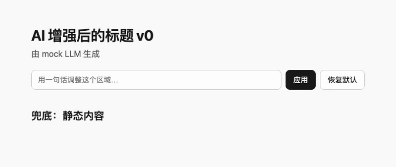
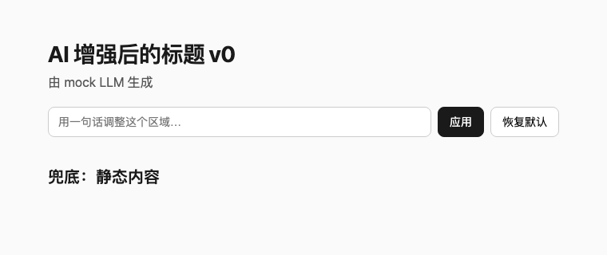
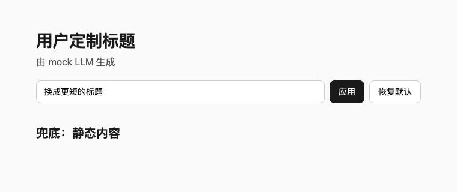
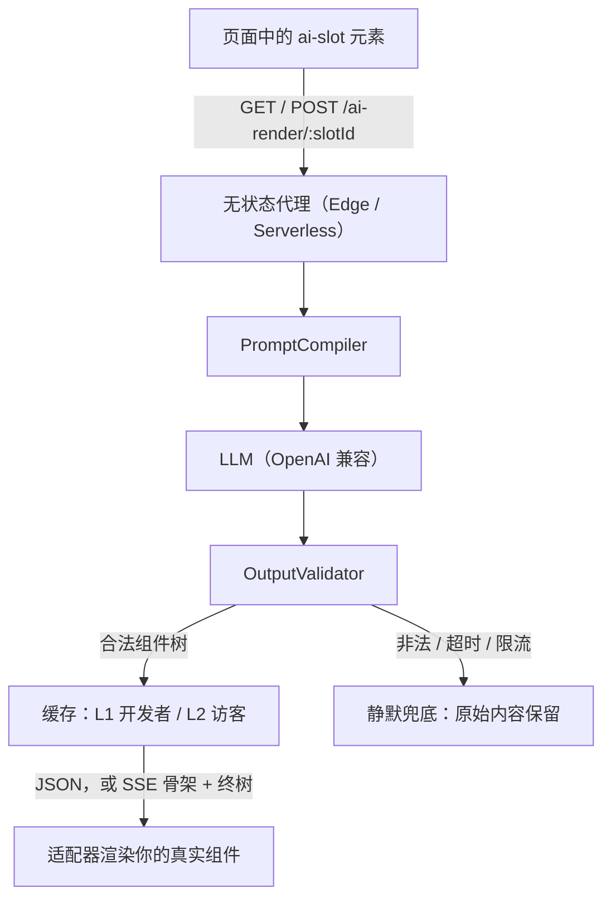

<div align="center">

# ai-slot-component

**存量页面的 AI 内容交付层。**

[English](./README.md) | 简体中文

[](https://nodejs.org)
[](https://pnpm.io)
[](./packages/runtime)
[](./packages/adapter-react)
[](./packages/adapter-vue)
[](https://www.npmjs.com/package/@ai-slot/runtime)

</div>

存量页面已经有内容、爬虫和用户，缺的是一个安全**接收** AI 生成内容的途径。ai-slot 就是这一层：把页面中的一块区域包起来，里面的内容原样保留——原始标记一字不改，并永远作为兜底内容：

```html
<ai-slot name="hero" src="/ai-render/hero">
  <section class="hero">
    <h1>我们的产品</h1>
    <p>一个普通的产品介绍。</p>
  </section>
</ai-slot>
```

这个元素背后是一条交付流水线：无状态服务端代理把模型输出变成**经过校验的组件树**（绝不返回 HTML），由适配器渲染成你真实的组件——经双层缓存交付、可骨架帧流式、数据源变更时重新推送。一旦模型超时、编造组件名或违反 props Schema，上面的原始标记会静默保留。SEO、无障碍与页面可用性从不依赖模型。

内容进入槽位有三种交付方式——访客个性化只是其中之一：

| 交付方式 | 触发 | 路径 |
|---|---|---|
| **预生成** | 构建期（`prewarm.mjs`） | 烘焙进 `ai-cache.json`，长 TTL 缓存，零运行时 LLM 调用 |
| **实时更新** | 数据源变更 | 失效推送让所有打开的页面自动重渲染——无需发版 |
| **个性化** | 访客提示词（`editable`） | 清洗、限流、短 TTL——只作用于该槽位 |

## 快速开始

前置要求：Node ≥ 18、[pnpm](https://pnpm.io)（`corepack enable`）。无需 API 密钥——示例默认使用确定性 mock LLM。

```bash
git clone https://github.com/iannil/ai-slot-component
cd ai-slot-component
pnpm install && pnpm build
node examples/plain-html/server.mjs
# → 打开 http://localhost:4173
```

示例页把三种交付方式都放在手边：hero 槽位带 `stream` + `live` + `editable`，`broken` 槽位演示静默兜底，`POST /admin/publish` 模拟数据源变更，`node examples/plain-html/prewarm.mjs` 烘焙 `ai-cache.json` 走预生成路径。

切换到真实模型：

```bash
OPENAI_API_KEY=sk-... node examples/plain-html/server.mjs
# 可选：AI_BASE_URL（任意 OpenAI 兼容端点）
# 可选：AI_MODEL_DEVELOPER（默认 gpt-4o）/ AI_MODEL_USER（默认 gpt-4o-mini）
```

跑起来了？一个 ⭐ 能帮更多人看到这个项目。

<p align="center">
  
</p>
<p align="center">
  
  
</p>

## 特性

- **老站即插即用** —— 把现有标记包进 `<ai-slot>` 即可；纯 HTML、React、Vue 都能接，无需重写。
- **AI 内容当静态资源发** —— `prewarm.mjs` 在构建期把开发者提示词烘焙进 `ai-cache.json`，生产环境零运行时 LLM 调用。
- **内容更新不发版** —— `live` 订阅失效推送；数据源一变，所有打开的页面自动重渲染。
- **骨架帧优先的流式** —— `stream` 走 SSE：先渲染骨架帧，终树到达后替换。
- **协议中立** —— 今天说原生 JSON，明天经 `@ai-slot/a2ui` 说 [A2UI](https://github.com/a2ui-project/a2ui)；端点换了，页面不用改。
- **访客个性化按槽位选配** —— `editable` 给该槽位加一行提示词输入框：清洗、限流、短 TTL。
- **开箱即离线** —— 默认确定性 mock LLM；单元测试用 fixture 回放，绝不真实调 API。

## 为什么安全

- **模型永远不写标记。** 它只返回组件树 JSON，组件名必须存在于你声明的注册表，并在渲染前通过 props Schema、slots 规则、嵌套深度与节点数上限校验。提示词注入到不了你的 DOM。
- **页面永不挂掉。** 任何失败——网络、超时、限流、非法输出——都静默回退到 `<ai-slot>` 内的原始内容。不白屏，也不向访客报错。
- **密钥只留在服务端。** LLM 密钥只存在于代理；访客提示词经清洗、限长后作为受限上下文注入，并配有 token 预算、8s 超时、每分钟限流与用量日志。
- **原始内容始终在页面里。** `<ai-slot>` 是渐进增强：爬虫与无 JS 访客看到的仍是你的真实内容。

## 协议中立的设计

ai-slot 分为三层：

1. **槽位协议** —— AI 端点与页面之间的线格式。原生 JSON 之外，[A2UI](https://github.com/a2ui-project/a2ui)（Google 开源的 agent 驱动 UI 协议）经 [`@ai-slot/a2ui`](./packages/a2ui) 同样可用。
2. **交付运行时** —— `<ai-slot>`、客户端二次校验、保证回退。
3. **生命周期基础设施** —— 双层缓存、构建期预热、失效推送、限流。

任何 A2UI 兼容端点都能喂给存量页面：

```ts
import { defineRegistry } from "@ai-slot/registry";
import { createDomRenderer } from "@ai-slot/adapter-dom";
import { configureAiSlot, registerRenderer, registerWireFormat } from "@ai-slot/runtime";
import { a2uiWireFormat, basicCatalogComponentDefs, basicCatalogDomDefs } from "@ai-slot/a2ui";

const registry = defineRegistry({
  components: { ...basicCatalogComponentDefs /* , your brand components */ },
});
registerWireFormat("a2ui", a2uiWireFormat);
registerRenderer("dom", createDomRenderer(basicCatalogDomDefs));
configureAiSlot({ registry, onFailure: (f) => console.debug(f) });
```

| | A2UI / AG-UI | ai-slot |
|---|---|---|
| 层级 | agent ↔ 应用内 UI 的线格式（Google / CopilotKit） | 公开网页内容槽位的交付层——经 `@ai-slot/a2ui` 说 A2UI |
| 存量页面 | 遗留内容被 iframe 沙箱隔离 | 原地包裹既有 HTML，零改写 |
| SEO 与爬虫 | 客户端渲染，爬虫不可见（包括 Googlebot） | 原始内容永在 HTML 里——爬虫与 AI 搜索可见 |
| 生命周期 | 无服务端组件（无缓存、预热、失效） | 双层 TTL、构建期预热、失效推送、限流 |

## 用法

> 各包已发布到 npm（`@ai-slot/*`）：客户端 `npm install @ai-slot/runtime @ai-slot/adapter-dom`（A2UI 端点另装 `@ai-slot/a2ui`）；服务端 `npm install @ai-slot/proxy @ai-slot/registry`。若要参与 monorepo 开发，克隆后 `pnpm install && pnpm build`。

**1. 声明 AI 可用的积木**（代理、运行时、构建工具三方共用）：

```ts
import { defineRegistry } from "@ai-slot/registry";

export const registry = defineRegistry({
  components: {
    "hero-banner": {
      description: "页面顶部主视觉区",
      props: {
        title: { type: "string", maxLength: 60 },
        subtitle: { type: "string", maxLength: 120 },
      },
      required: ["title"],
    },
  },
});
```

**2. 接上代理** —— Web 标准 `(Request) => Promise<Response>`，可直接部署到 Node、Edge 或任意 Serverless 运行时：

```ts
import { createAiRenderHandler, createOpenAIClient } from "@ai-slot/proxy";
import { registry } from "./registry.js";

export const handler = createAiRenderHandler({
  registry,
  llm: createOpenAIClient({ apiKey: process.env.OPENAI_API_KEY! }), // baseUrl：任意 OpenAI 兼容端点
  resolveSlot: (slotId) => slots[slotId] ?? null,
});
// 暴露 GET/POST /ai-render/:slotId —— GET 走 CI 预生成，POST 走实时交付（含访客提示词）。
```

**3. 渲染** —— 按你的技术栈选：

```html
<!-- 纯 HTML -->
<script type="module">
  import { configureAiSlot, registerRenderer } from "@ai-slot/runtime";
  import { createDomRenderer } from "@ai-slot/adapter-dom";
  import { registry } from "./registry.js";
  import { domComponents } from "./components.js";

  registerRenderer("dom", createDomRenderer(domComponents));
  configureAiSlot({ registry });
</script>
```

```tsx
// React ≥ 18 —— 任何失败保留 fallback，语义与 Web Component 一致
<AiSlot src="/ai-render/hero" components={{ "hero-banner": HeroBanner }} fallback={<HeroStatic />} editable />
```

```vue
<!-- Vue ≥ 3.4 —— 默认 slot 即兜底内容 -->
<AiSlot src="/ai-render/hero" :components="vueComponents">
  <HeroStatic />
</AiSlot>
```

### `<ai-slot>` 属性

| 属性 | 作用 |
|---|---|
| `src` | 该槽位的代理端点（`/ai-render/:slotId`） |
| `name` | 发送给代理的槽位 id |
| `renderer` | 使用的已注册渲染器（默认 `dom`） |
| `stream` | 走 SSE：先骨架帧，后终树 |
| `live` | 订阅失效推送，内容变更时自动重渲染（`live-src` 可覆盖端点） |
| `refresh-interval` | 每 N 秒重新拉取 |
| `editable` | 加一行提示词输入框，实时改写该槽位 |

## 交付流水线



## 包一览

| 包 | 职责 |
|---|---|
| [`@ai-slot/registry`](./packages/registry) | 协议核心：`defineRegistry`、组件树类型，以及代理、运行时、工具三方共用的 `OutputValidator` |
| [`@ai-slot/proxy`](./packages/proxy) | 无状态渲染代理：提示词编译、LLM 调用、校验、双层缓存、限流、SSE、失效推送、预生成 |
| [`@ai-slot/runtime`](./packages/runtime) | 零依赖 `<ai-slot>` Web Component + `registerRenderer` 注册表 |
| [`@ai-slot/adapter-dom`](./packages/adapter-dom) | 把组件树映射为纯 DOM（`tag` / `class` / `applyProps`），无需框架 |
| [`@ai-slot/adapter-react`](./packages/adapter-react) | `treeToReact` + `<AiSlot>` 组件 |
| [`@ai-slot/adapter-vue`](./packages/adapter-vue) | `treeToVue` + `AiSlot` 组件 |

## 开发

```bash
pnpm build                 # 构建全部包（ESM → dist/）
pnpm test                  # 全部单元测试（Vitest）
pnpm typecheck             # 依赖 dist 类型产物：干净 checkout 后先跑 pnpm build

pnpm --filter @ai-slot/runtime test            # 单包测试
cd packages/proxy && npx vitest run src/cache.test.ts   # 单个测试文件

# 端到端（Playwright，共 7 条）
pnpm --filter example-plain-html exec playwright install chromium
pnpm --filter example-plain-html test:e2e

# CI 预生成（生成 ai-cache.json，服务启动时自动水合）
node examples/plain-html/prewarm.mjs
```

类型检查是唯一的静态门禁——仓库没有 ESLint/Prettier 配置。

## 面向 AI 编程代理

- 仓库指南：[CLAUDE.md](CLAUDE.md) 与 [AGENTS.md](AGENTS.md)。实现工作的最终依据是 `docs/superpowers/specs/` 下的设计文档。
- 示例默认跑确定性 mock LLM，无需联网、无需密钥，`pnpm build && node examples/plain-html/server.mjs` 是代理可以安全执行的冒烟验证。
- `OutputValidator` 是纯函数，对抗性样例在 `packages/registry`——安全边界在这里，而不是提示词里。

## 项目状态

v1 与 v1.1 已全部合入 master：props 全局护栏、缓存序列化 + CI 预生成、SSE 流式、失效推送、React/Vue 适配器。

刻意推迟：token 级 LLM 增量流式、`live` 自动重连、多实例限流/缓存存储抽象。明确不做（YAGNI）：AI 生成任意 HTML/CSS、客户端 DOM 补丁协议、浏览器本地推理、多租户/计费后台。

## 参与

欢迎提 Issue 与 PR——架构、命令与约定见 [AGENTS.md](AGENTS.md)（Conventional Commits，中文提交信息）。

缺陷与功能请求：[GitHub Issues](https://github.com/iannil/ai-slot-component/issues)。

## 许可证

基于 [MIT 许可证](./LICENSE) 发布。
