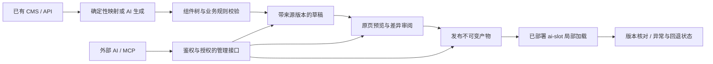

# AI-SLOT 官网与产品演进设计

日期：2026-10-10。状态：规划提案，未实施；不是新功能已上线声明。

## 决策与定位

AI-SLOT 是为已有网站、CMS 和建站工具增加局部 AI 生成、交付与管理能力的框架无关组件。保持宿主的数据、页面和工作流，用一个被授权的区域承接从创作到生效、再到持续维护的任务。

核心承诺分两层：今天提供注册组件树的校验、渲染、缓存与局部更新；下一阶段提供数据直连、版本发布与管理型 MCP。AI 可以生成内容、组合已注册组件，并通过授权接口管理它们；确定性数据更新无需调用模型。

商业证据仍不足以支持完整 SaaS 建设。下一步值得投入的是有上限的原型验证：证明一次接入后，反复更新的总人工劳动下降。沿用既有商业研究，不把本次产品规划冒充新增客户或付款证据。

## 代码核对与表达边界

| 项目 | 当前事实 | 规划动作 |
|---|---|---|
| 框架无关 | Web Component、DOM/React/Vue 适配器已存在 | 验证实际宿主；不使用“兼容所有建站产品” |
| 数据直连 | runtime 可消费合规端点；proxy 的 llm 必填 | 增加独立数据 provider，统一校验与交付 |
| AI 组件生成 | 组件树可组合注册组件 | 区分树实例、可复用配方、新组件代码 |
| 局部更新 | 缓存、预生成 JSON、SSE 失效通知已存在 | 加入发布版本、重连补偿、状态核对 |
| MCP | 官网有公开文档 search_docs/read_doc | 管理 MCP 另建，不能复用公共只读端点权限 |
| 运营后台 | 示例与官网虚拟后端演示 | 不宣称具备生产级审批、持久版本、回滚 |
| 渲染校验 | 服务端 validator 已有；客户端 registry 可选 | 新接入模板强制配置；兼容策略明确后推广 |
| DOM 命名槽位 | 当前明确忽略命名 slots | 管理型预览前补齐或拒绝不支持的树 |
| 正式域名 | README、Agent 配置登记 aislot.dev | 本规划沿用；ai-slot.dev 如需迁移另立任务 |

本次网页读取工具未能访问两种域名，不能据此判断站点下线。现状依据本地源码与发布记录；本次未执行线上烟测。

## 选择的路线

比较三种路径：

- 只改品牌文案：成本最低，但不能检验完整任务价值。
- 同时开发多平台插件与完整 SaaS：过早扩大平台支持、权限与运营成本。
- **推荐：通用核心 + 一个任务包 + 一个真实宿主 + 管理 MCP 薄接口。** 先跑通闭环，再验证第二宿主复用。

首个任务包建议为“活动/产品介绍区更新”：从 CMS 读取批准的产品事实，生成标题、摘要、按钮与卡片组合，预览差异，发布，核对线上版本，必要时恢复上一版。价格、库存等事实字段默认由数据绑定控制，AI 不自由改写。避免从金融建议、交易核心和复杂个性化开始。

第一批验证对象优先是维护已有客户站点、能提供真实更新任务的开发者或小型服务商。这是客户假设，不是已获客结论。首个宿主优先使用可控制脚本、服务端和原内容的 HTML/React/Vue + 现有 CMS；平台品牌由实际试点决定。

## 产品所有权

CMS 是事实源；宿主控制位置、外部布局、身份与主发布流程。AI-SLOT 保存授权区域的组件树、来源版本和发布记录。每个字段只能有一个写入权威。首期只读 CMS，不做通用双向同步。

人工锁定字段不得被 AI 重写。源版本变化使依赖它的旧草稿失效；发布需重新生成或显式复核。更新已部署组件的内容/组合可免宿主重新部署；安装槽位、增加新组件代码、修改宿主模板仍可能需要发布。

AI 新组件代码走开发者工作流：代码草稿 → 测试与审查 → 注册并部署。严禁把任意 AI HTML/CSS/JS 作为内容热更新执行。组件配方只保存合法组件树与参数约束，不是运行时脚本。

## 最小闭环架构

渲染请求不隐式创建草稿或发布；内容生产与公开交付分开。浏览器公开端点只能读已发布产物。管理服务独立部署，SDK 使用者可以不用它。管理 MCP 复用领域操作，不把业务逻辑复制到工具处理器。

## 降低审阅与纠错劳动

1. 一次配置槽位意图、允许组件、字段来源、禁止改动与发布策略。
2. 草稿展示文本差异、布局差异、源数据差异与目标槽位，不要求重审整页。
3. 同时验证结构、链接、字段来源、人工锁定项和宿主渲染；Schema 合法不等于事实正确。
4. 权限按站点/槽位/动作授予；低风险且满足规则的更新可预授权发布，越界才要求人工处理。
5. 发布结果返回版本号；浏览器渲染状态是单独证据。接口成功不等于所有访客已看见。
6. 源过期、计划到期或故障时使用明确的中性兜底，不能无条件恢复失效优惠。

MCP 本身不会定时执行任务。持续管理还需要宿主事件、调度器或外部 Agent；首期先用明确调用，调度作为后续扩展。

## 阶段与投入门槛

以下为单名熟悉代码的开发者的粗估人日，含开发与技术验证，不含等候客户、平台审核、采购及正式上线；不是交付承诺。

| 阶段 | 工作 | 粗估 | 退出条件 |
|---|---|---:|---|
| W0 | 官网表达修正、公开文档同步 | 2–3 | 已有能力与路线图不混淆 |
| P0 | 数据 provider、接入模板、适配器基础边界 | 4–6 | 无模型更新真实局部，失败保留兜底 |
| P1 | 最小持久版本、预览/发布/回滚 | 6–10 | 重启不丢版本，并发发布拒绝覆盖 |
| P2 | 授权 MCP 与完整任务演示 | 4–6 | Agent 按权限完成闭环，越权失败 |
| V1 | 首宿主任务对照与复用验证 | 3–5 | 总人工成本和重复使用可观察 |
| 条件扩展 | 第二宿主薄封装、调度、配方 | 单独估算 | 前阶段有实际增量价值证据 |

不一次性批准上述所有投入。建议首轮以 W0 + P0、最多 9 人日为可撤回预算；若没有可触达试点，也先停在此阶段。P1/P2 只有在获得真实任务和宿主访问条件后继续。接入失败或总劳动不降，先缩窄任务/改善接口，不用加更多平台掩盖问题。

## 验证口径

对同一类真实任务比较“原平台 + 当前流程”和“原平台 + AI-SLOT”，质量要求相同，记录创作、审阅、纠错、上线、维护时间，单列初次接入成本。包含失败尝试，不能只记录最快一次。

`累计净节省 = Σ(原流程人工分钟 − 新流程人工分钟) − 接入与额外维护分钟`

建议团队试验阈值：先观察 3–5 个重复任务；稳定更新的人工时间中位数降低至少 30%，并且没有未经授权发布、事实字段被改写或新增严重页面故障；再计算接入成本能否在客户可接受周期回收。数字是决策阈值，不是行业基准，也不能证明普遍市场需求。

支持成本、客户付费、重复使用、原生平台 AI 是否已经足够好，均要单独取证。若只有一次性价值，优先考虑项目交付/实施收入；没有持续价值前不承诺订阅模式。免费 SDK 的采用不能直接证明管理服务可收费。

## 范围外

完整 CMS、任意代码在线执行、多租户与计费后台、通用双向同步、全平台插件矩阵、自动优化转化率、全量 A/B 平台、token 级流式输出、多实例缓存与限流重构，均不在首轮范围。版本库所需最小持久化不等于批准重写全部存储架构。

## 配套计划与依据

- [官网实施计划](../plans/2026-10-10-ai-slot-website-update.md)
- [组件实施计划](../plans/2026-10-10-ai-slot-component-evolution.md)
- [既有商业研究](../../research/2026-10-10-ai-slot-platform-enhancement/REPORT.md)
- [原始技术设计](2026-09-24-ai-native-rendering-sdk-design.md)
- [交付边界](../../delivery-boundaries.md)、[官网 Agent 接入](../../agent-access.md)

本设计补充原设计；未明确改变的安全边界继续有效。新的接口、包名和版本命名是提案，不能在实施前写成已发布 API。
