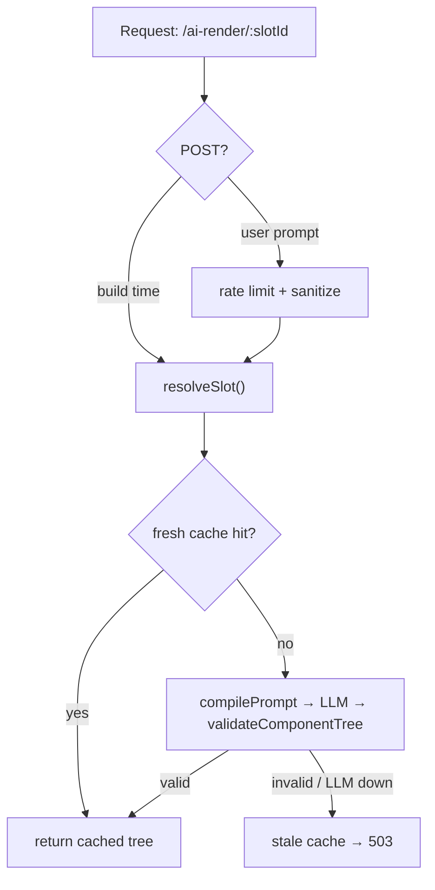

# @ai-slot/proxy

> AI-rendered page content — without leaked API keys, invalid LLM output, or white screens.

The server side of the **ai-slot-component** SDK (private monorepo, not yet on npm): one stateless handler that turns a slot ID into a **validated component tree**. It speaks Web standard `Request → Response`, so it deploys unchanged to Cloudflare Workers, Deno, Bun, Vercel Edge, or a plain Node server.

```text
PromptCompiler → LLM Client (retry, 8s timeout) → OutputValidator → Cache (fresh → stale → 503)
```

中文文档：[仓库 CLAUDE.md](../../CLAUDE.md) · [总体设计](../../docs/superpowers/specs/2026-09-24-ai-native-rendering-sdk-design.md)

## Quick start

Workspace install (Node ≥ 18): `pnpm install && pnpm build` at the repo root, then `import ... from "@ai-slot/proxy"` in any workspace package.

```ts
import { createAiRenderHandler, createOpenAIClient } from "@ai-slot/proxy";
import { defineRegistry } from "@ai-slot/registry";

// 1. Declare the only components the LLM may ever output.
const registry = defineRegistry({
  components: {
    "hero-banner": {
      description: "Page hero section",
      props: { title: { type: "string", maxLength: 60 }, subtitle: { type: "string", maxLength: 120 } },
      required: ["title"],
    },
  },
});

// 2. Map slot IDs to the original page content you want enhanced.
const slots = new Map([
  ["hero", {
    slotId: "hero",
    originalContent: "<h1>Our product</h1><p>A plain product intro.</p>",
    developerPrompt: "Audience: developers. Emphasize the 5-minute integration.",
    contentVersion: "v1", // bump to bust the L1 cache
  }],
]);

// 3. Assemble the handler. Your key stays here, on the server.
const handler = createAiRenderHandler({
  registry,
  llm: createOpenAIClient({ apiKey: process.env.OPENAI_API_KEY! }),
  resolveSlot: (slotId) => slots.get(slotId) ?? null,
});

export default handler;
// Serve it: Deno.serve(handler) · Bun.serve({ fetch: handler })
// · or wrap in node:http like examples/plain-html/server.mjs
```

```bash
curl "http://localhost:8000/ai-render/hero"
```

```json
{
  "version": 1,
  "slot": "hero",
  "tree": { "component": "hero-banner", "props": { "title": "Ship AI-enhanced pages in 5 minutes" } },
  "meta": { "reason": "developer-prompt" }
}
```

That `tree` is what [`<ai-slot>` in packages/runtime](../runtime/) renders; the element's original content stays on the page as the fallback.

## Two paths, one endpoint

| | `GET /ai-render/:slotId` | `POST /ai-render/:slotId` |
|---|---|---|
| Who calls it | You, at build time | End users, at runtime |
| Prompt | Developer prompt, from `resolveSlot()` | User prompt, request body `{ "prompt": "..." }` |
| Cache | L1 — fresh 1 h, key = slot + `contentVersion` + `promptVersion` | L2 — fresh 10 min, key = slot + normalized prompt (trim/lowercase/collapse whitespace, so "  Big   Title " and "big title" share an entry) |
| Guardrails | — | 10 requests/min/IP (`x-forwarded-for`), prompt sanitized to ≤500 chars with control characters stripped |
| Typical use | `prewarm()` in CI, then serve static | `<ai-slot editable>` live rewriting |

Model tiers follow the paths: `models.developer` for GET (default `gpt-4o-mini`), `models.user` for POST — point the cheap model at live user traffic.

## Why it is safe to put an LLM on your page

- **The model never outputs HTML.** It may only compose components from your registry; `validateComponentTree` (from `@ai-slot/registry`, shared with the client runtime) enforces component names, prop schemas, slot nesting, depth, and node count. Anything else is discarded.
- **Keys never reach the browser.** Every LLM call happens inside this handler.
- **Failure is invisible.** Retry once → fall back to stale cache (1 day window) → `503 ai_unavailable`. The `<ai-slot>` element keeps its original content either way: no white screen, no user-facing error.
- **User prompts are untrusted input.** They are sanitized, then injected as constrained context — never as instructions — and the validator has the final say.
- **Budgets are enforced, not hoped for.** 8 s timeout, `maxTokens` cap (default 2000), per-IP rate limit, and an `onUsage` hook for billing/tuning logs.

## Streaming: skeleton first, tree second

Send `Accept: text/event-stream` and the same endpoint responds with two SSE frames — the skeleton is derived from the final tree, so the placeholder already has the exact shape the real render will take:

```text
event: skeleton
data: {"version":1,"slot":"hero","tree":{"component":"hero-banner","props":{"title":"","subtitle":""}},"meta":{"phase":"skeleton"}}

event: tree
data: {"version":1,"slot":"hero","tree":{...full tree...},"meta":{"reason":"developer-prompt"}}
```

Client side: `<ai-slot stream>`. Cached hits are re-framed as SSE too, so streaming and caching never disagree.

## Pregenerate in CI ("AI static pages")

```ts
const store = new MemoryCacheStore();
const handler = createAiRenderHandler({
  registry, llm, store, resolveSlot,
  developerTtlMs: 24 * 3600_000, staleMs: 7 * 24 * 3600_000,
});

const { ok, failed } = await prewarm(handler, ["hero", "pricing"]); // one slot failing won't abort the rest
await writeFile("ai-cache.json", store.dump());
```

Ship `ai-cache.json` with your build, then hydrate at boot:

```ts
const store = MemoryCacheStore.load(await readFile("ai-cache.json", "utf8"), Date.now());
```

Expired entries are dropped on load; your live path inherits the prewarmed cache with zero extra code.

## Push invalidation when your data changes

`createInvalidationChannel()` gives you an SSE endpoint plus a broadcast function; you decide what triggers it (CMS webhook, cron diff, admin route).

```ts
const invalidation = createInvalidationChannel(); // { handler, invalidate, subscriberCount }
// route GET /ai-invalidate to invalidation.handler
invalidation.invalidate("hero"); // → event: invalidate / data: {"slot":"hero"} to every subscriber
```

`?slot=<id>` filter, `: ping` heartbeat every 25 s (configurable via `heartbeatMs`), subscribers cleaned up on disconnect. Client side: `<ai-slot live live-src="/ai-invalidate">`.

## How it works



## API

### `createAiRenderHandler(opts)`

| Option | Type | Default | Notes |
|---|---|---|---|
| `registry` | `Registry` | — | required — the component allowlist |
| `llm` | `LLMClient` | — | required — any provider; wrapped in `withRetry` (1 retry) for you |
| `resolveSlot` | `(slotId) => SlotSource \| null` | — | required — return `null` for unknown slots |
| `models` | `{ developer?, user? }` | `gpt-4o-mini` / `gpt-4o-mini` | per-path model tiers |
| `maxTokens` | `number` | `2000` | token budget per call |
| `store` | `MemoryCacheStore` | new instance | pass one to share with `prewarm()` or hydrate from disk |
| `developerTtlMs` | `number` | `3_600_000` | L1 fresh window |
| `userTtlMs` | `number` | `600_000` | L2 fresh window |
| `staleMs` | `number` | `86_400_000` | how long a stale entry may still serve as fallback |
| `rateLimit` | `{ limit, windowMs } \| false` | `{ 10, 60_000 }` | POST only; in-process, swap in a shared store for multi-instance |
| `onUsage` | `(entry: UsageLogEntry) => void` | — | called after every successful LLM call; callback errors are swallowed |
| `now` | `() => number` | `Date.now` | injectable clock for tests |

Errors are plain JSON, and every failure mode is distinct:

| Status | `error` | When |
|---|---|---|
| 400 | `invalid_prompt` | missing/empty/oversized user prompt |
| 404 | `not_found` | path is not `/ai-render/:slotId` |
| 404 | `unknown_slot` | `resolveSlot` returned `null` |
| 405 | `method_not_allowed` | anything but GET/POST |
| 429 | `rate_limited` | POST over the per-IP limit |
| 503 | `ai_unavailable` | LLM failed or output invalid, with no stale cache to serve |

### Bring your own model

`LLMClient` is one method — point it at Anthropic, a local model, or a fixture:

```ts
const llm = {
  async complete({ model, system, user, maxTokens }) {
    return { text: JSON.stringify({ version: 1, slot: "hero", tree: { component: "hero-banner", props: { title: "Hello" } } }) };
  },
};
```

`createOpenAIClient({ apiKey, baseUrl?, fetchImpl? })` covers any OpenAI-compatible endpoint (DeepSeek, vLLM, gateways) with zero SDK dependency and JSON-mode output.

### Module map

| Module | What it is |
|---|---|
| `handler.ts` | `createAiRenderHandler` — routing, caching, degradation chain, SSE negotiation |
| `cache.ts` | `MemoryCacheStore` (+ `dump`/`load`), `prewarm` cache keys, fresh/stale `lookup` |
| `prewarm.ts` | CI pregeneration over the developer path |
| `prompt-compiler.ts` | layered prompt: system rules → registry constraints → developer prompt → user prompt (narrowest last) |
| `llm-client.ts` | `LLMClient` interface, `LLMError`, `withRetry` |
| `openai-client.ts` | fetch-based OpenAI-compatible adapter |
| `sanitize.ts` | user prompt filter (type, length, control characters) |
| `rate-limit.ts` | in-process sliding-window limiter |
| `invalidate.ts` | `createInvalidationChannel` — SSE invalidation push |

## Development

```bash
pnpm --filter @ai-slot/proxy test        # all unit tests, no network access needed
cd packages/proxy && npx vitest run src/handler.test.ts -t "降级"   # one file / one case
pnpm --filter @ai-slot/proxy typecheck   # run pnpm build first on a clean checkout
```

Every LLM in the test suite is a fixture or a mock — nothing here calls a real API, so the package is safe to explore and modify with a coding agent. The spec of record is [`docs/superpowers/specs/2026-09-24-ai-native-rendering-sdk-design.md`](../../docs/superpowers/specs/2026-09-24-ai-native-rendering-sdk-design.md).

## The monorepo

| Package | Role |
|---|---|
| [`@ai-slot/registry`](../registry/) | protocol + `OutputValidator` — the security boundary, consumed by proxy, runtime, and build tooling |
| **`@ai-slot/proxy`** | this package — stateless render proxy |
| [`@ai-slot/runtime`](../runtime/) | zero-dependency `<ai-slot>` element (`stream`, `live`, `editable`) |
| [`@ai-slot/adapter-dom`](../adapter-dom/) / [`adapter-react`](../adapter-react/) / [`adapter-vue`](../adapter-vue/) | map validated trees onto your real components |
| [`examples/plain-html`](../../examples/plain-html/) | end-to-end demo: legacy page, editable + streaming + live slots, Playwright e2e |
